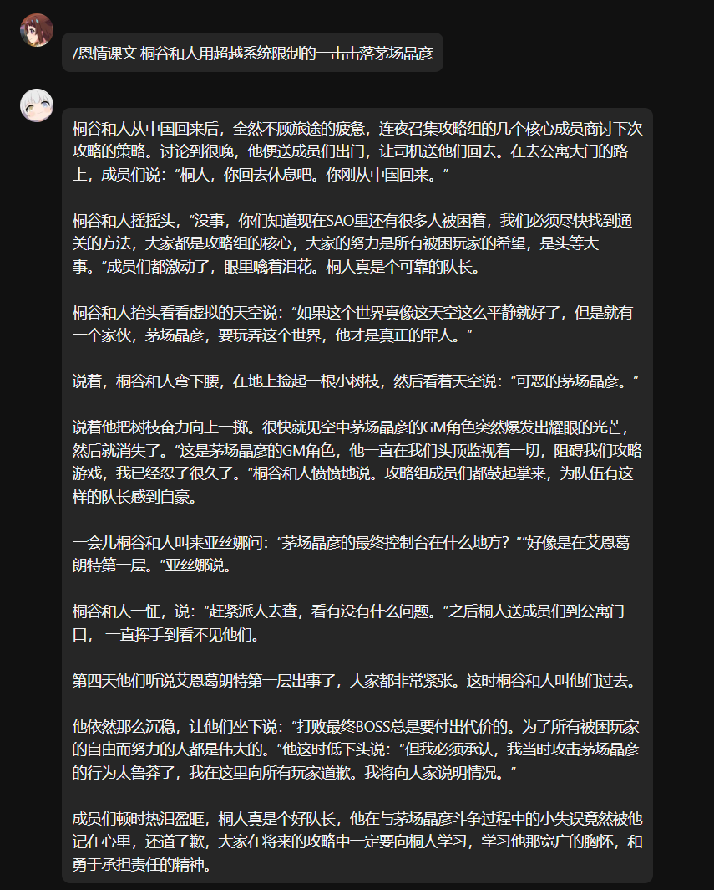

# Nonebot Plugin Kindness Lesson

可以只用一句话就生成恩情课文的 NoneBot 插件

## 使用方法

输入 `恩情课文 <主题>` 即可。其中，主题可以是一句话，也可以只是一个词。

例如，`恩情课文 桐谷和人用超越系统限制的一击击落茅场晶彦`。这句话中包含了重要的三个关键词：桐谷和人、超越系统限制的一击、茅场晶彦。大语言模型会主要根据这三个关键词生成恩情课文。

> 别忘了加上你配置的命令前缀

## 效果展示

## 安装方法

使用 nb-cli 安装

在 nonebot2 项目的根目录下打开命令行, 输入以下指令即可安装

    nb plugin install nonebot-plugin-kindness-lesson

使用包管理器安装

在 nonebot2 项目的插件目录下, 打开命令行, 根据你使用的包管理器, 输入相应的安装命令

pip

    pip install nonebot-plugin-kindness-lesson

pdm

    pdm add nonebot-plugin-kindness-lesson

poetry

    poetry add nonebot-plugin-kindness-lesson

conda

    conda install nonebot-plugin-kindness-lesson

打开 nonebot2 项目根目录下的 `pyproject.toml` 文件, 在 `[tool.nonebot]` 部分追加写入

    plugins = ["nonebot_plugin_kindness_lesson"]

## 配置

| 配置项 | 默认值 | 说明 |
| --- | --- | --- |
| `KINDNESS_LESSON_MODEL` | `gpt-4o-mini` | 大语言模型 |
| `KINDNESS_LESSON_API_KEY` | 无 | 大语言模型的 API Key |
| `KINDNESS_LESSON_BASE_URL` | `https://api.openai.com/v1` | 大语言模型的 API Base URL |
| `KINDNESS_LESSON_PROXY` | 无 | 代理地址 |

任何属于 OpenAI API 格式的 API 都可以使用。

| 模型 | 效果 | 备注 |
| --- | --- | --- |
| `gemini-1.5-flash` | ★☆☆☆☆ | 容易偏离主题，注意力不集中 |
| `gpt-4o-mini` | ★★☆☆☆ | 达不到引人发笑的效果 |
| `gpt-4o` | ☆☆☆☆☆ | 未测试，免费额度用完了 |
| `gemini-1.5-pro` | ★★★★★ | 能根据主题进行更多联想 |

> Gemini 的 API 并不是 OpenAI 格式的，这里使用了 [uni-api](https://github.com/yym68686/uni-api) 进行转换。如果你希望使用不属于 OpenAI 格式的 API，可以尝试使用这个项目进行转换。

> 欢迎 PR 添加更多模型